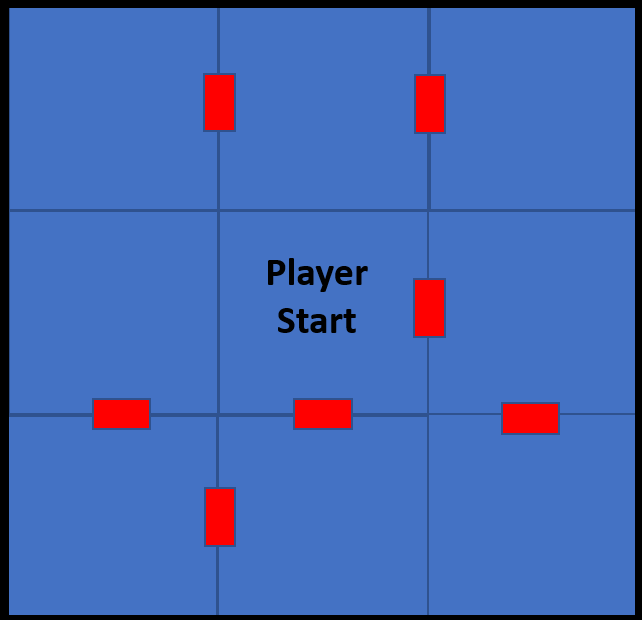

# Projeto Recurso Introdução à Computação 2022/2023

## Introdução 
Neste trabalho os alunos terão que implementar um *Dungeon Crawl* na linha de commandos do Python. 

## Contexto do Jogo
O jogador encontra-se numa casa assombrada com várias salas interligadas. Para o jogador fugir, tem que encontrar duas chaves que se encontram pela casa, para abrir a porta que se encontra logo na primeira sala do nível.

Para implementar este jogo com sucesso, o aluno tem que mapear o nivel em memoria, oferecer descrições de cada sala para o jogador e conseguir ler e responder ao input do jogador effectivamente.

### Objectivo do Jogo
O objectivo do jogo é encontrar duas chaves que se encontram dispersas pela casa assombrada. O objetivo do jogador é descobrir estas duas chaves e abrir a porta que se encontra na sala inicial logo quando o jogo começa (i.e. voltar à sala inicial com as duas chaves). 

#### Fluxo do Jogo
O fluxo do jogo segue uma metadologia *pergunta e resposta*, onde a cada instancia de jogo o jogador insere um comando especifico, e o jogo responde consoante o comando inserido. Os comandos devem consistir no seguinte: 

- E (explore) : Retorna a descrição da sala. Caso a chave existir na sala, é incluído uma descrição adicional para a chave.  
- M (move) : Move o jogador nas direções possíveis dessa sala:
	- N (North): Vai para a porta norte
	- S (South): Vai para a porta south
	- E (East): Vai para a porta este
	- W (West): Vai para a porta oeste
- K (key): Caso existir uma chave esta é posta no inventário do jogador

#### A Casa Assombrada

A casa assombrada consiste numa matriz de 3x3, onde cada sala consiste numa descrição escrita e de portas alocadas a: Norte, Sul, Este, Oeste; no qual o jogador poderá usar para se mover para outra sala. Para simplificar o nível é estático e tem sempre a mesma arquitectura. 

#### Iniciar o Jogo
Apesar do nivel do jogo ter sempre o mesmo numero de salas (i.e. 9), o local onde as duas chaves são alocadas devem ser aleatórias, e nunca pode haver mais do que 1 chave em cada sala (ou seja não pode existir uma sala com duas chaves). O jogador começa sempre e acaba na sala do meio.

## Objetivos e Critério de Avaliação

Este projeto tem os seguintes objetivos:

-   **O1** - Programa deve funcionar como especificado. Atenção aos detalhes, pois é fácil desviarem-se das especificações caso não **leiam o enunciado com atenção**.
-   **O2** - Projeto e código bem organizados, nomeadamente:
    -   Código devidamente comentado e indentado.
    -   Inexistência de código "morto", que não faz nada, como por exemplo variáveis, propriedades ou métodos nunca usados.
    -   Projeto compila e executa sem erros e/ou _warnings_.
-   **O3** - Projeto adequadamente documentado com *comentários* descrevendo a funcionalidade de várias secções do código.
-   **O4** - Repositório Git deve refletir boa utilização do mesmo, nomeadamente:
    -   Devem existir _commits_ de todos os elementos do grupo, _commits_ esses com mensagens que sigam as melhores práticas para o efeito (como indicado [aqui](https://chris.beams.io/posts/git-commit/), [aqui](https://gist.github.com/robertpainsi/b632364184e70900af4ab688decf6f53), [aqui](https://github.com/erlang/otp/wiki/writing-good-commit-messages) e [aqui](https://stackoverflow.com/questions/2290016/git-commit-messages-50-72-formatting)).
    -   Ficheiros binários não necessários, não devem estar no repositório. Ou seja, devem ser ignorados ao nível do ficheiro `.gitignore`.
-   **O5** - Relatório em formato [Markdown](https://guides.github.com/features/mastering-markdown/) (ficheiro `README.md`), organizado da seguinte forma:
    -   Título do projeto.
    -   Autoria:
        -   Nome dos autores (primeiro e último) e respetivos números de aluno.
        -   Informação de quem fez o quê no projeto. Esta informação é **obrigatória** e deve refletir os _commits_ feitos no Git.
        -   Indicação do repositório Git utilizado. Esta indicação é opcional, pois podem preferir manter o repositório privado após a entrega.
    -   Arquitetura da solução:
        -   Descrição da solução, com breve explicação de como o código foi organizado, bem como dos algoritmos não triviais que tenham sido implementados.
    -   Referências, incluindo trocas de ideias com colegas, código aberto reutilizado (e.g., do StackOverflow) e bibliotecas de terceiros utilizadas. Devem ser o mais detalhados possível.
    -   **Nota:** o relatório deve ser simples e breve, com informação mínima e suficiente para que seja possível ter uma boa ideia do que foi feito. Atenção aos erros ortográficos e à correta formatação [Markdown](https://guides.github.com/features/mastering-markdown/), pois ambos serão tidos em conta na nota final.

O projeto tem um peso de 5 valores na nota final da disciplina e será avaliado de forma qualitativa. Isto significa que todos os objetivos têm de ser parcialmente ou totalmente cumpridos. A cada objetivo, O1 a O5, será atribuída uma nota entre 0 e 1. A nota do projeto será dada pela seguinte fórmula:

_N = 10 x O1 x O2 x O3 x O4 x O5_

Isto significa que se os alunos ignorarem completamente um dos objetivos, não tenham feito nada no projeto ou não comparecerem na discussão, a nota final será zero.

### Requisito Mínimo do Projeto

- Implementar o sistema de input e output
- Implementar o sistema de movimento do jogador
- Implementar o sistema de chaves aleatórias
- Implementar o nivel como definido
- Implementar o sistema de descrições para cada sala

### Pontuação Extra

- Sistema de portas dinâmicas (i.e. o numero de salas permanece, mas a posição das portas muda no inicio de cada jogo).
- Sistema de dano, onde se o jogador tenta apanhar uma chave numa sala onde não exista - leva dano.
- Sistema de descrições mais desenvolvida (existe mais do que uma descrição da sala, ou o comando explore tem mais funcionalidades para explorar uma sala).

## Entrega
O projeto deve ser entregue **pelo aluno** via Moodle até às **23:59** do dia **10 de Fevereiro 2023**. Cada aluno deve submeter um ficheiro `zip` com a solução completa, nomeadamente:

-   Pasta escondida `.git` com o repositório Git local do projeto.
-   Pasta do projeto, contendo os ficheiros todos deste.
-   Ficheiro `README.md` contendo o relatório do projeto em formato [Markdown](https://guides.github.com/features/mastering-markdown/).
-   Ficheiro de imagem contendo o Fluxograma. Este ficheiro deve ser incluído no repositório em modo Git LFS.
-   Outros ficheiros de configuração, como por exemplo `.gitignore` e `.gitattributes`.

**Não serão avaliados projetos sem estes elementos e que não sejam entregues através do Moodle.**

## Honestidade académica
Nesta disciplina, espera-se que cada aluno siga os mais altos padrões de honestidade académica. Isto significa que cada ideia que não seja do aluno deve ser claramente indicada, com devida referência ao respectivo autor. O não cumprimento desta regra constitui plágio.

O plágio inclui a utilização de ideias, código ou conjuntos de soluções de outros alunos ou indivíduos, ou quaisquer outras fontes para além dos textos de apoio à disciplina, sem dar o respectivo crédito a essas fontes. Os alunos são encorajados a discutir os problemas com outros alunos e devem mencionar essa discussão quando submetem os projetos. Essa menção **não** influenciará a nota. Os alunos não deverão, no entanto, copiar códigos, documentação e relatórios de outros alunos, ou dar os seus próprios códigos, documentação e relatórios a outros em qualquer circunstância. De facto, não devem sequer deixar códigos, documentação e relatórios em computadores de uso partilhado, e muito menos usar repositórios Git públicos (embora os mesmos possam ser tornados públicos 12h após a data limite de submissão).

Nesta disciplina, a desonestidade académica é considerada fraude, com todas as consequências legais que daí advêm. Qualquer fraude terá como consequência imediata a anulação dos projetos de todos os alunos envolvidos (incluindo os que possibilitaram a ocorrência). Qualquer suspeita de desonestidade académica será relatada aos órgãos superiores da escola para possível instauração de um processo disciplinar. Este poderá resultar em reprovação à disciplina, reprovação de ano ou mesmo suspensão temporária ou definitiva da ULHT.

_Texto adaptado da disciplina de [Algoritmos e Estruturas de Dados](https://fenix.tecnico.ulisboa.pt/disciplinas/AED-2/2009-2010/2-semestre/honestidade-academica) do [Instituto Superior Técnico](https://tecnico.ulisboa.pt/pt/)_

## Licenças
Este enunciado é disponibilizado através da licença [CC BY-NC-SA 4.0](https://creativecommons.org/licenses/by-nc-sa/4.0/).

## Metadados
-   Autores: [Phil Lopes](https://github.com/worshipcookies) e [Ana Pinha]()
-   Curso: [Licenciatura em Videojogos](https://www.ulusofona.pt/licenciatura/videojogos)
-   Instituição: [Universidade Lusófona de Humanidades e Tecnologias](https://www.ulusofona.pt/)

